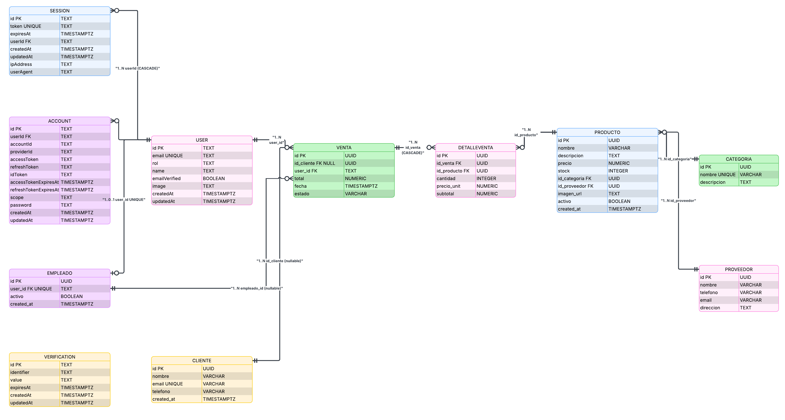

# Consultas SQL del proyecto IceStock

Resumen de las operaciones sobre PostgreSQL usadas por la aplicación. El código fuente está centralizado en [`src/lib/db.ts`](../../src/lib/db.ts); el esquema y objetos de BD en [`db/schema.sql`](../../db/schema.sql).

## Diagramas del modelo

### Diagrama entidad–relación

### Diagrama relacional

---

## Objetos en la base de datos

| Objeto | Tipo | Uso |
|--------|------|-----|
| `vista_ventas_completa` | VIEW | Reportes del día, listados desnormalizados para UI |
| `vista_metricas_empleado` | VIEW | Totales por vendedor (admin / analista) |
| `registrar_venta(...)` | FUNCTION | Registro transaccional (JSONB de ítems); `SECURITY DEFINER` |
| `fn_mis_compras(uuid)` | FUNCTION | Historial del cliente (`rol_cliente`) |
| `fn_catalogo_activo()` | FUNCTION | Catálogo activo para tienda |
| Índices en FK / `Venta.fecha` | INDEX | Filtros por fecha, joins y listados |

## Roles PostgreSQL (`db/roles.sql`)

| Rol PG | `user.rol` | Resumen |
|--------|------------|---------|
| `rol_cliente` | `cliente` | Catálogo, `fn_mis_compras`, registrar compra propia |
| `rol_cajero` | `cajero` | POS, ventas, `registrar_venta` |
| `rol_analista` | `analista` | Solo `SELECT` + vistas (CSV / gráficos) |
| `rol_admin` | `admin` | Analista + CRUD catálogo + anular ventas |
| `rol_superadmin` | `superadmin` | Todo el esquema de negocio |

Conexión: `icestock_app` (o `proy3` en Docker) con `SET ROLE` según sesión. Ver [`db/roles.sql`](../../db/roles.sql).

### Capa API (permisos HTTP)

La aplicación valida cada handler con la matriz en [`src/lib/api/permissions.ts`](../../src/lib/api/permissions.ts) (`can`, `requireAuthAndPermission`). Resumen documentado en [docs/endpoints.md — Permisos por rol](../endpoints.md#permisos-por-rol).

---

## Autenticación

Las tablas `user`, `session`, `account` y `Verification` las gestiona **Better Auth** vía `/api/auth/*`. En `db.ts` solo se insertan usuarios de personal al crear empleados:

| Función | Operación | Tablas |
|---------|-----------|--------|
| `findUserByEmail` | `SELECT id FROM "user" WHERE LOWER(email) = …` | `user` |
| `createUserAccountAndEmpleado` | `INSERT` en `user`, `account`, `Empleado` (transacción) | `user`, `account`, `Empleado` |
| `updateUserEmpleadoProfile` | `UPDATE "user" SET name, rol …` | `user` |
| `deactivateEmpleadoByUserId` | `UPDATE Empleado SET activo = FALSE` | `Empleado` |

---

## Catálogo

### Categorías y proveedores

CRUD estándar: `INSERT` / `SELECT` / `UPDATE` / `DELETE` por `id` (UUID).

| Función | Endpoint API (ejemplo) |
|---------|------------------------|
| `getCategorias`, `getCategoria`, `createCategoria`, `updateCategoria`, `deleteCategoria` | `/api/categorias` |
| `getProveedores`, `getProveedor`, `createProveedor`, … | `/api/proveedores` |
| `countProductosByCategoria` | Validación antes de borrar categoría |
| `countProductosByProveedor` | Validación antes de borrar proveedor |

### Productos

| Función | Descripción SQL |
|---------|-----------------|
| `getProductosListApi` | `SELECT` con `JOIN Categoria`, `Proveedor`; filtros `activo`, `id_categoria`, `ILIKE` nombre, `stock < 20` |
| `getProductoEnriquecido` | Detalle con nombres de categoría y proveedor |
| `createProducto` / `updateProducto` / `deleteProducto` | CRUD sobre `Producto` |
| `softDeleteProducto` | `UPDATE Producto SET activo = FALSE` |
| `getProductosConCategoriaYProveedor` | Listado analítico con joins |

---

## Clientes

| Función | Descripción |
|---------|-------------|
| `getClientes`, `getCliente`, `createCliente`, `updateCliente`, `deleteCliente` | CRUD |
| `getOrCreateClienteForUser` | Busca por email; si no existe, `INSERT` (tienda / `GET /api/clientes/me`) |
| `getClienteConStats` | Cliente + `COUNT`/`SUM` de ventas completadas |
| `getVentasByClienteId` | Historial para **Mis compras** (`GET /api/clientes/me/ventas`) |
| `getClientesConCompraMayorA` | Subconsulta `Venta.total >= $monto` |
| `getClientesFrecuentesApi` | Clientes con más de 3 compras completadas |

---

## Empleados

| Función | Descripción |
|---------|-------------|
| `getEmpleados`, `getEmpleado`, `createEmpleado`, `updateEmpleado`, `deleteEmpleado` | CRUD + join con `user` |
| `getEmpleadoByUserId` | Resuelve empleado desde sesión |
| `getOrCreateEmpleadoForUser` | Crea fila `Empleado` si admin/cajero aún no la tiene (POS) |

---

## Ventas (núcleo transaccional)

### `crearVentaTransaccional` (usado por `POST /api/ventas`)

Transacción en Node (`BEGIN` / `COMMIT` / `ROLLBACK`):

1. Por cada ítem: `SELECT … FROM Producto … FOR UPDATE` (stock y precio).
2. `INSERT INTO Venta` (`id_cliente`, `user_id`, `empleado_id`, `total = 0`).
3. Por cada ítem: `INSERT DetalleVenta`, `UPDATE Producto SET stock = stock - cantidad`.
4. `UPDATE Venta SET total = …`.

Equivalente conceptual en SQL: función `registrar_venta(p_userId, p_idCliente, p_empleadoId, p_items JSONB)`.

### Consultas de ventas

| Función | Descripción |
|---------|-------------|
| `getVentasListApi` | Listado con `LEFT JOIN Cliente`, `Empleado`, `user`; filtro opcional por rango de fechas |
| `getVentaDetalleApi` | Cabecera + líneas con nombre de producto |
| `anularVentaTransaccional` | `FOR UPDATE` venta; devuelve stock; `estado = 'anulada'` |
| `getVentasDesdeVista` | `SELECT` desde `vista_ventas_completa` |
| `getVentasConClienteYEmpleado` | Agregación `COUNT` líneas por venta |

### Detalle de venta (CRUD auxiliar)

`createDetalleVenta`, `getDetalleVenta`, `getDetallesVenta`, `updateDetalleVenta`, `deleteDetalleVenta` — uso interno o extensiones; el flujo principal usa la transacción anterior.

---

## Reportes y analítica

| Función | Endpoint API | Idea de la consulta |
|---------|--------------|----------------------|
| `getReporteVentasDelDia` | `GET /api/reportes/ventas-del-dia` | `vista_ventas_completa` filtrada por fecha + agregados |
| `getProductosMasVendidosApi` | `GET /api/reportes/productos-mas-vendidos` | CTE: suma `cantidad`/`subtotal` por producto |
| `getStockDisponibleApi` | `GET /api/reportes/stock-disponible` | Productos activos, alerta si `stock < 20` |
| `getVentasPorCategoriaReporteApi` | `GET /api/reportes/ventas-por-categoria` | `GROUP BY` categoría sobre ventas completadas |
| `getVentasPorCategoria` | Dashboard / analítica | Similar con `HAVING` por monto mínimo |
| `getProductosSinVentas` | Analítica | `NOT EXISTS` en `DetalleVenta` |
| `getRankingProductosCte` | Dashboard | CTE + `DENSE_RANK()` por monto vendido |
| `getDetalleVentaJoin` | Analítica | Join detalle–producto–categoría |

`getDashboardData()` agrupa en una sola llamada varias de las consultas anteriores para el portal admin.

---

## Patrones SQL recurrentes

| Patrón | Ejemplo en el proyecto |
|--------|-------------------------|
| Transacción explícita | `crearVentaTransaccional`, `anularVentaTransaccional`, `createUserAccountAndEmpleado` |
| Bloqueo de fila | `SELECT … FOR UPDATE` en producto (stock) y venta (anulación) |
| Precio histórico | `DetalleVenta.precio_unit` al insertar; no se recalcula si cambia `Producto.precio` |
| Soft delete | `Producto.activo = FALSE` |
| Vista desnormalizada | `vista_ventas_completa` para reportes sin romper 3FN en tablas base |
| Parámetros dinámicos | Filtros de fecha y búsqueda en `getVentasListApi`, `getProductosListApi` |

---

## Mapa función → capa HTTP

| Capa | Ubicación |
|------|-----------|
| Handlers REST | `src/routes/api/**/*.ts` |
| Acceso a datos | `src/lib/db.ts` |
| Contrato documentado | [../endpoints.md](../endpoints.md), [../openapi.json](../openapi.json), Swagger en `/api/docs` |

Para el proceso de diseño de tablas, ver [normalization.md](./normalization.md).
